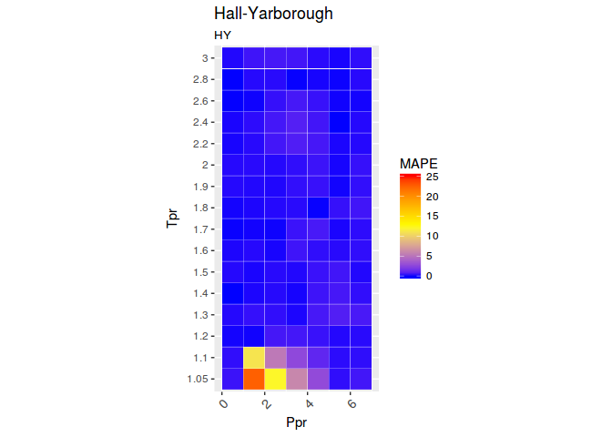
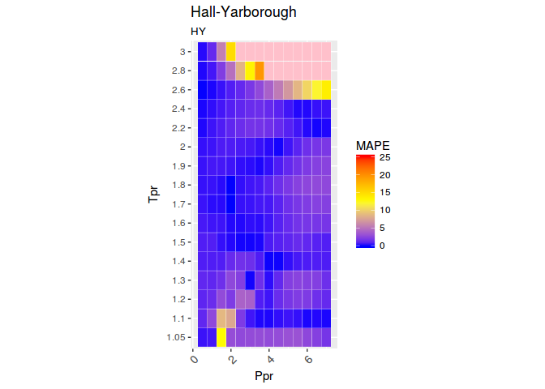
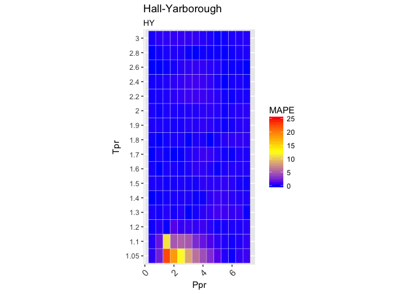
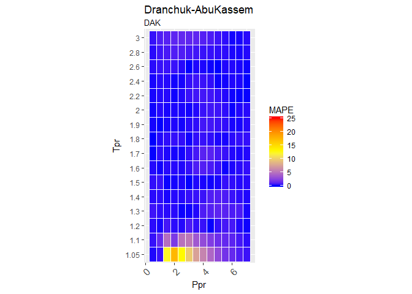

[](http://www.rdocumentation.org/packages/zFactor)

<!-- README.md is generated from README.Rmd. Please edit that file -->
zFactor
=======

Computational tools for chemical and petroleum engineers. Calculates the error between different correlations for gas compressibility.

Motivation
----------

The correlations that are implemented in R for `zFactor` are:

-   Beggs and Brill (BB)
-   Hall and Yarborough (HY)
-   Dranchuk and Abou-Kassem (DAK)
-   Dranchuk, Purvis and Robnson (DPR)
-   A correlation by Shell Oil Company (SH)
-   A correlation developed with Artificial Neural Networks (Ann10) by Kamyab et al

Note. The Shell correlation was found cited in two books and two papers but the original paper or authors could not be found.

Installation
------------

You can install the latest version of `zFactor` from github with:

``` r
# install.packages("devtools")
devtools::install_github("f0nzie/zFactor")
```

Or from `CRAN`:

``` r
install.packages("zFactor")
```

Usage
-----

``` r
library(zFactor)

# get `z` values from the Standing-Katz chart
tpr <- c(1.2, 1.3, 1.5, 2.0, 3.0) 
ppr <- c(0.5, 1.5, 2.5, 3.5, 4.5, 5.5) 
getStandingKatzMatrix(ppr_vector = ppr, tpr_vector = tpr, 
                                 pprRange = "lp")
#>        0.5   1.5   2.5   3.5   4.5   5.5
#> 1.20 0.893 0.657 0.519 0.565 0.650 0.741
#> 1.30 0.916 0.756 0.638 0.633 0.684 0.759
#> 1.50 0.948 0.859 0.794 0.770 0.790 0.836
#> 2.00 0.982 0.956 0.941 0.937 0.945 0.969
#> 3.00 1.002 1.009 1.018 1.029 1.041 1.056

# calculate `z` using the Beggs-Brill correlation
z.BeggsBrill(pres.pr = 1.5, temp.pr = 2.0)
#> [1] 0.962902

# calculate `z` using the Hall-Yarborough correlation
z.HallYarborough(pres.pr = 1.5, temp.pr = 2.0)
#> [1] 0.9580002

# calculate `z` using the correlation Dranchuk-AbousKassem
ppr <- c(0.5, 1.5, 2.5, 3.5, 4.5, 5.5, 6.5) 
tpr <- c(1.05, 1.1, 1.7, 2) 
z.DranchukAbuKassem(ppr, tpr)
#>            0.5       1.5       2.5       3.5       4.5       5.5       6.5
#> 1.05 0.8300683 0.2837318 0.3868282 0.5063005 0.6239783 0.7392097 0.8521762
#> 1.1  0.8570452 0.4463987 0.4125200 0.5178068 0.6281858 0.7378206 0.8458725
#> 1.7  0.9681353 0.9128087 0.8753784 0.8619509 0.8721085 0.9003962 0.9409634
#> 2    0.9824731 0.9551087 0.9400752 0.9385273 0.9497137 0.9715388 1.0015560

# We do the same with the Dranchuk-Purvis-Robinson correlation
# but we change the values of the isotherms `Tpr`
tpr <- c(1.4, 1.4, 1.6, 1.7, 1.8) 
z.DranchukPurvisRobinson(pres.pr = ppr, temp.pr = tpr)
#>           0.5       1.5       2.5       3.5       4.5       5.5       6.5
#> 1.4 0.9374909 0.8155126 0.7275722 0.7083606 0.7404910 0.7977524 0.8666456
#> 1.4 0.9374909 0.8155126 0.7275722 0.7083606 0.7404910 0.7977524 0.8666456
#> 1.6 0.9602585 0.8891708 0.8399510 0.8230070 0.8364902 0.8709715 0.9183151
#> 1.7 0.9677844 0.9121791 0.8752677 0.8630002 0.8743271 0.9033216 0.9440582
#> 1.8 0.9736897 0.9298230 0.9022519 0.8944207 0.9053965 0.9311395 0.9672850

# now we use the relative undocumented Shell correlation
z.Shell(ppr, tpr)
#>           0.5       1.5       2.5       3.5       4.5       5.5       6.5
#> 1.4 0.9357838 0.8097802 0.7271788 0.7040931 0.7315325 0.7907497 0.8641572
#> 1.4 0.9357838 0.8097802 0.7271788 0.7040931 0.7315325 0.7907497 0.8641572
#> 1.6 0.9613216 0.8863715 0.8331061 0.8120822 0.8224613 0.8570695 0.9073678
#> 1.7 0.9711067 0.9150837 0.8740757 0.8563697 0.8629757 0.8901157 0.9321262
#> 1.8 0.9794808 0.9395295 0.9097288 0.8964473 0.9015059 0.9233190 0.9584750

# and finally the correlation Kamyab et al that uses Artificial Neural Networks
z.Ann10(ppr, tpr)
#>           0.5       1.5       2.5       3.5       4.5       5.5       6.5
#> 1.4 0.9367118 0.8179531 0.7301083 0.7058966 0.7360320 0.7938440 0.8650626
#> 1.4 0.9367118 0.8179531 0.7301083 0.7058966 0.7360320 0.7938440 0.8650626
#> 1.6 0.9607316 0.8909372 0.8413772 0.8186001 0.8303206 0.8669610 0.9174184
#> 1.7 0.9682749 0.9146453 0.8767457 0.8581919 0.8672123 0.8978116 0.9413442
#> 1.8 0.9758251 0.9330673 0.9033038 0.8900081 0.8983954 0.9253309 0.9638663
```

Comparative Analysis
--------------------

Range of Applicability
----------------------

``` r
library(zFactor)

zFactor:::z.plot.range("HY", interval = "coarse")
```



``` r
zFactor:::z.plot.range("BB")
```



``` r

zFactor:::z.plot.range("DAK")
```


``` r

zFactor:::z.plot.range("DPR")
```



``` r

zFactor:::z.plot.range("SH")
```


``` r
zFactor:::z.plot.range("SH", interval = "fine")
```



``` r

zFactor:::z.plot.range("N10")
```


What you can do with `zFactor`
------------------------------

-   Find `z` with any of the correlations provided
-   Get values from the Standing-Katz chart at any of the isotherms limited by the pseudo-reduced pressures (`Ppr`) digitized
-   Find what isotherms or pseudo-reduced temperatures (`Tpr`) are available from Standing and Katz chart
-   Find what pseudo-reduced pressure points are available
-   Plot any of the Standing-Katz isotherms to view `z` in graphical form
-   Plot a tile chart to show the range of applicability of the correlations
-   Get a statistics table when comparing any of the correlations to the Standing-Katz chart
-   Get a matrix of \``z` values calculated from any correlation where the rows are the pseudo-reduced temperatures and the columns the pseudo-reduced pressures

Vignettes
---------

The vignettes contain examples on the use and analysis of the various correlations.

-   StandingKatz\_chart.Rmd
-   Beggs-Brill.Rmd
-   Hall-Yarborough.Rmd
-   Dranchuk-AbouKassem.Rmd
-   Dranchuk-Purvis-Robinson.Rmd
-   shell.Rmd
-   ANN.Rmd

Tests
-----

There are tests for the correlations under tests/testthat.

References
----------

The following books and papers were consulted during the development of this package:

Ahmed, Tarek. 2007. *Equations of State and Pvt Analysis*. Houston, Texas: Gulf Publishing. <https://books.google.com/books?id=_a_tAQAAQBAJ&source=gbs_similarbooks>.

Bahadori, Alireza. 2016. *Fluid Phase Behavior for Conventional and Unconventional Oil and Gas Reservoirs*. Houston, Texas: Gulf Publishing. <https://books.google.com/books?id=BwXeDAAAQBAJ>.
