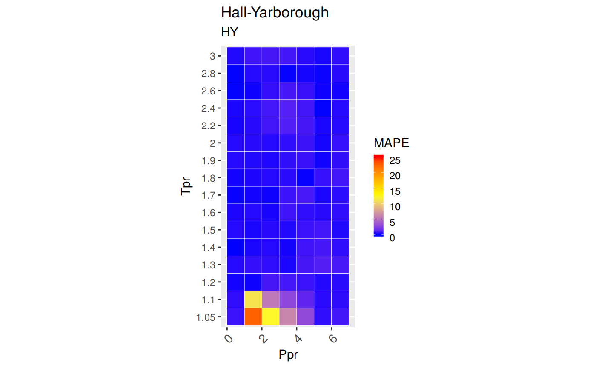
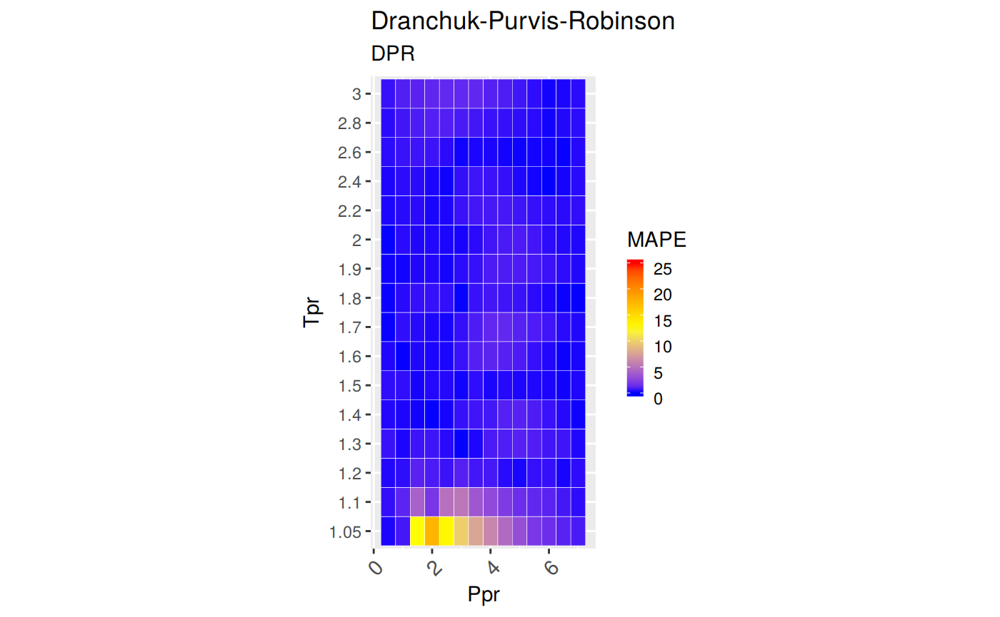

[](https://cran.r-project.org/package=zFactor) [](https://travis-ci.org/f0nzie/zFactor) [](https://codecov.io/gh/f0nzie/zFactor)

<!-- README.md is generated from README.Rmd. Please edit that file -->
zFactor
=======

Computational tools for chemical, petrochemical and petroleum engineers. Calculates the deviation between different correlations for gas compressibility compared to the original Standing-Katz chart.

Motivation
----------

For the development of vertical lift performance (VLP) curves and other petroleum engineering calculations, it is necessary to calculate properties of hydrocarbons in mixtures, liquid and gaseous phases. **Compressibility** is one of these hydrocarbon properties. It is important to count with the apropriate correlation and know its range of applicability in order to calculate other properties dependant of `z`.

There are several compressibility correlations. In this package, few of them, or the most used in the industry, are being evaluated. There have been extensive studies on compressibility correlations. This evaluation is different in the sense that provides a graphical view of the range of applicability as well statistical measures of the errors, besides that the work has been written fully in `R` providing the analysis and results for peer review and reproducibility purposes. All the code, functions, notes, datasets are available via GitHub.

This analysis focus on sweet hydrocarbon gases. Compressibility correlations for sour gases are little bit more complicated since they show significant deviations from the curves in the Standing-Katz charts. Effects of CO2, H2S and N2 have to be accounted for. In a future release of `zFactor` correlations for *sour hydrocarbons gases* will possibly be covered.

Correlations used in this study
-------------------------------

The correlations that are implemented in R for the package **zFactor** are:

-   Beggs and Brill (BB) `(Azizi N. Behbahani R., 2010)`

-   Hall and Yarborough (HY) `(Hall and Yarborough, 1973)`

-   Dranchuk and Abou-Kassem (DAK) `(Dranchuk and Abou-Kassem, 1975)`

-   Dranchuk, Purvis and Robinson (DPR) `(Dranchuk, Purvis, Robinson, and others, 1973)`

-   A correlation by Shell Oil Company (SH) `(Kumar, 2004)`, `(Bahadori, 2016)`, `(de Almeida, Velásquez, and Barbieri, 2014)`, `(Al-Anazi, Pazuki, Nikookar, and Al-Anazi, 2011)`, `(Azizi N. Behbahani R., 2010)`, `(Mohamadi-Baghmolaei, Azin, Osfouri, Mohamadi-Baghmolaei, and Zarei, 2015)`. The Shell correlation was found cited in two books and several papers (including the equation and constants), but the original paper or authors could not be identified.

-   A correlation developed with Artificial Neural Networks (Ann10) by Kamyab et al. `(Kamyab, Sampaio, Qanbari, and Eustes, 2010)`

-   An explicit correlation by *I. Papp* `(Papp, 1979)` mentioned in the comparative analysis paper by Gabor Takacs `(Takacs, 1989)`. Not available in English.

Versions
--------

-   In CRAN: `v 0.1.6`
-   In GitHub `dev-0.1.6.9010`

Installation
------------

I recommend installing from GitHub using `devtools`, that way you get the latest and greatest version. CRAN release cycles allows updates every one to two months.

You can install the latest version of `zFactor` from GitHub with:

``` r
# install.packages("devtools")
devtools::install_github("f0nzie/zFactor")
```

Or, if your prefer, from `CRAN`:

``` r
install.packages("zFactor")
```

Usage
-----

``` r
library(zFactor)

# get `z` values from the Standing-Katz chart
tpr <- c(1.2, 1.3, 1.5, 2.0, 3.0) 
ppr <- c(0.5, 1.5, 2.5, 3.5, 4.5, 5.5) 
getStandingKatzMatrix(ppr_vector = ppr, tpr_vector = tpr, 
                                 pprRange = "lp")
#>        0.5   1.5   2.5   3.5   4.5   5.5
#> 1.20 0.893 0.657 0.519 0.565 0.650 0.741
#> 1.30 0.916 0.756 0.638 0.633 0.684 0.759
#> 1.50 0.948 0.859 0.794 0.770 0.790 0.836
#> 2.00 0.982 0.956 0.941 0.937 0.945 0.969
#> 3.00 1.002 1.009 1.018 1.029 1.041 1.056

# calculate `z` using the Beggs-Brill correlation
z.BeggsBrill(pres.pr = 1.5, temp.pr = 2.0)
#> [1] 0.962902

# calculate `z` using the Hall-Yarborough correlation
z.HallYarborough(pres.pr = 1.5, temp.pr = 2.0)
#> [1] 0.9580002

# calculate `z` using the correlation Dranchuk-AbousKassem
ppr <- c(0.5, 1.5, 2.5, 3.5, 4.5, 5.5, 6.5) 
tpr <- c(1.05, 1.1, 1.7, 2) 
z.DranchukAbuKassem(ppr, tpr)
#>            0.5       1.5       2.5       3.5       4.5       5.5       6.5
#> 1.05 0.8300683 0.2837318 0.3868282 0.5063005 0.6239783 0.7392097 0.8521762
#> 1.1  0.8570452 0.4463987 0.4125200 0.5178068 0.6281858 0.7378206 0.8458725
#> 1.7  0.9681353 0.9128087 0.8753784 0.8619509 0.8721085 0.9003962 0.9409634
#> 2    0.9824731 0.9551087 0.9400752 0.9385273 0.9497137 0.9715388 1.0015560

# We do the same with the Dranchuk-Purvis-Robinson correlation
# but we change the values of the isotherms `Tpr`
tpr <- c(1.4, 1.4, 1.6, 1.7, 1.8) 
z.DranchukPurvisRobinson(pres.pr = ppr, temp.pr = tpr)
#>           0.5       1.5       2.5       3.5       4.5       5.5       6.5
#> 1.4 0.9374909 0.8155126 0.7275722 0.7083606 0.7404910 0.7977524 0.8666456
#> 1.4 0.9374909 0.8155126 0.7275722 0.7083606 0.7404910 0.7977524 0.8666456
#> 1.6 0.9602585 0.8891708 0.8399510 0.8230070 0.8364902 0.8709715 0.9183151
#> 1.7 0.9677844 0.9121791 0.8752677 0.8630002 0.8743271 0.9033216 0.9440582
#> 1.8 0.9736897 0.9298230 0.9022519 0.8944207 0.9053965 0.9311395 0.9672850

# now we use the relative undocumented Shell correlation
z.Shell(ppr, tpr)
#>           0.5       1.5       2.5       3.5       4.5       5.5       6.5
#> 1.4 0.9357838 0.8097802 0.7271788 0.7040931 0.7315325 0.7907497 0.8641572
#> 1.4 0.9357838 0.8097802 0.7271788 0.7040931 0.7315325 0.7907497 0.8641572
#> 1.6 0.9613216 0.8863715 0.8331061 0.8120822 0.8224613 0.8570695 0.9073678
#> 1.7 0.9711067 0.9150837 0.8740757 0.8563697 0.8629757 0.8901157 0.9321262
#> 1.8 0.9794808 0.9395295 0.9097288 0.8964473 0.9015059 0.9233190 0.9584750

# the newly added Papp correlation
z.Papp(ppr, tpr)
#>           0.5       1.5       2.5       3.5       4.5       5.5       6.5
#> 1.4 0.9408336 0.8010648 0.7076525 0.6906870 0.7299354 0.7958370 0.8705316
#> 1.4 0.9408336 0.8010648 0.7076525 0.6906870 0.7299354 0.7958370 0.8705316
#> 1.6 0.9657774 0.8864710 0.8252564 0.8026787 0.8182983 0.8604984 0.9168234
#> 1.7 0.9736623 0.9138939 0.8665932 0.8471834 0.8578133 0.8919610 0.9406180
#> 1.8 0.9796287 0.9345928 0.8988524 0.8837788 0.8922563 0.9208289 0.9632719

# and finally the correlation Kamyab et al that uses Artificial Neural Networks
z.Ann10(ppr, tpr)
#>           0.5       1.5       2.5       3.5       4.5       5.5       6.5
#> 1.4 0.9367118 0.8179531 0.7301083 0.7058966 0.7360320 0.7938440 0.8650626
#> 1.4 0.9367118 0.8179531 0.7301083 0.7058966 0.7360320 0.7938440 0.8650626
#> 1.6 0.9607316 0.8909372 0.8413772 0.8186001 0.8303206 0.8669610 0.9174184
#> 1.7 0.9682749 0.9146453 0.8767457 0.8581919 0.8672123 0.8978116 0.9413442
#> 1.8 0.9758251 0.9330673 0.9033038 0.8900081 0.8983954 0.9253309 0.9638663
```

Range of Applicability
----------------------

How to interpret the colors? We use the [Mean Absolute Percentage Error](https://en.wikipedia.org/wiki/Mean_absolute_percentage_error) or `MAPE` to visualize how close the correlation follow the experimental values of the Standing-Katz chart.

-   `Blue`: the MAPE is zero or near zero
-   `Yellow`: the MAPE is around 10 percent.
-   'Red\`: the MAPE has reached 25% or more
-   `Pink`: the mean absolute percentage error is above or way above 25%.

You can see for yourself which correlation is more stable at different ranges of pseudo-reduce pressures and temperatures.

#### Beggs-Brill

``` r
library(zFactor)
zFactor:::z.plot.range("BB",  interval = "fine")
```


#### Hall-Yarborough

``` r
zFactor:::z.plot.range("HY",  interval = "fine")
```


``` r
zFactor:::z.plot.range("HY",  interval = "coarse")
```



#### Dranchuk-AbouKassem

``` r
zFactor:::z.plot.range("DAK", interval = "fine")
```


#### Dranchuk-Purvis-Robinson

``` r
zFactor:::z.plot.range("DPR", interval = "fine")
```



#### Shell (Shell Oil Company)

``` r
zFactor:::z.plot.range("SH",  interval = "fine")
```


#### Ann10 (Neural Network, 10 neurons)

``` r
zFactor:::z.plot.range("N10", interval = "fine")
```


#### Papp (explicit)

``` r
zFactor:::z.plot.range("PP",  interval = "fine")
```


Comparative Analysis
--------------------

The comparative analysis shows tables with different error measurements:

    MSE:   Mean Squared Error
    RMSE:  Root Mean Squared Error
    RSS:   Residual sum of Squares
    RMSLE: Root Mean Squared Logarithmic Error. Penalizes understimation.
    MAPE:  Mean Absolute Percentage Error = AARE
    MPE:   Mean Percentage error = ARE
    MAE:   Mean Absolute Error

What you can do with `zFactor`
------------------------------

-   Find `z` with any of the correlations provided
-   Get values from the Standing-Katz chart at any of the isotherms limited by the pseudo-reduced pressures (`Ppr`) digitized
-   Find what isotherms or pseudo-reduced temperatures (`Tpr`) are available from the Standing and Katz chart
-   Find what pseudo-reduced pressure points are available
-   Plot any of the Standing-Katz isotherms to view `z` in graphical form
-   Plot a tile chart to show the range of applicability of the correlations. In essence, get an idea of the accuracy by the location of the desired point at Tpr and Ppr
-   Get a statistics table when comparing any of the correlations to the Standing-Katz chart
-   Get a matrix of `z` values calculated from any correlation where the rows are the pseudo-reduced temperatures and the columns the pseudo-reduced pressures
-   Plot one or multiple isotherms

### Plotting a specific isotherm of SK chart

``` r
library(zFactor)
getStandingKatzCurve(tpr = 1.3, toView = FALSE, toSave = FALSE)
```


``` r
getStandingKatzCurve(tpr = 1.05, pprRange = "lp", toView = FALSE, toSave = FALSE)
```


### Ploting all the `Tpr` curves of Standing-Katz chart using `lapply`, `getStandingKatzData` and `data.table::rbindlist`:

``` r
library(zFactor)
library(ggplot2)
library(data.table)

tpr_vec <- c(1.05, 1.1, 1.2, 1.3, 1.5, 1.6, 1.7, 1.9, 2.0, 2.4, 2.6, 2.8, 3.0)
all_tpr2 <- (lapply(tpr_vec, function(x) getStandingKatzData(tpr = x)))
names(all_tpr2) <- tpr_vec

all_tpr_df <- data.table::rbindlist(all_tpr2, idcol = TRUE)
colnames(all_tpr_df)[1] <- "Tpr"

ggplot(all_tpr_df, aes(x=Ppr, y=z, group=Tpr, color=Tpr)) + 
    geom_line() +
    geom_point()
```


### Build a table of statistical errors between a correlation and SK chart

``` r
library(ggplot2)
library(tibble)
library(dplyr)

# get all Tpr curves at low pressure (lp)
tpr_all <- getStandingKatzTpr(pprRange = "lp")
ppr <- c(0.5, 1.5, 2.5, 3.5, 4.5, 5.5, 6.5) 
sk_corr_all <- createTidyFromMatrix(ppr, tpr_all, correlation = "DPR")
grouped <- group_by(sk_corr_all, Tpr, Ppr)

smry_tpr_ppr <- summarise(grouped, 
          RMSE  = sqrt(mean((z.chart-z.calc)^2)), 
          MPE   = sum((z.calc - z.chart) / z.chart) * 100 / n(),
          MAPE  = sum(abs((z.calc - z.chart) / z.chart)) * 100 / n(), 
          MSE   = sum((z.calc - z.chart)^2) / n(), 
          RSS   = sum((z.calc - z.chart)^2),
          MAE   = sum(abs(z.calc - z.chart)) / n(),
          RMLSE = sqrt(1/n()*sum((log(z.calc +1)-log(z.chart +1))^2))
          )
as.tibble(smry_tpr_ppr)
#> # A tibble: 112 x 9
#> # Groups:   Tpr [?]
#>      Tpr   Ppr         RMSE        MPE       MAPE          MSE
#>    <chr> <dbl>        <dbl>      <dbl>      <dbl>        <dbl>
#>  1  1.05   0.5 0.0009756528  0.1176903  0.1176903 9.518984e-07
#>  2  1.05   1.5 0.0319670358 12.6351920 12.6351920 1.021891e-03
#>  3  1.05   2.5 0.0444731970 12.9659466 12.9659466 1.977865e-03
#>  4  1.05   3.5 0.0361451067  7.6741203  7.6741203 1.306469e-03
#>  5  1.05   4.5 0.0271306123  4.5368917  4.5368917 7.360701e-04
#>  6  1.05   5.5 0.0137256422  1.8879838  1.8879838 1.883933e-04
#>  7  1.05   6.5 0.0080944856  0.9567950  0.9567950 6.552070e-05
#>  8   1.1   0.5 0.0026367700  0.3087553  0.3087553 6.952556e-06
#>  9   1.1   1.5 0.0169389191  3.9762721  3.9762721 2.869270e-04
#> 10   1.1   2.5 0.0190546763  4.8485181  4.8485181 3.630807e-04
#> # ... with 102 more rows, and 3 more variables: RSS <dbl>, MAE <dbl>,
#> #   RMLSE <dbl>
```

Vignettes
---------

The vignettes contain examples on the use and analysis of the various correlations.

-   StandingKatz\_chart.Rmd
-   Beggs-Brill.Rmd
-   Hall-Yarborough.Rmd
-   Dranchuk-AbouKassem.Rmd
-   Dranchuk-Purvis-Robinson.Rmd
-   shell.Rmd
-   ANN.Rmd
-   Papp.Rmd

Tests
-----

There are unit tests for the correlations under tests/testthat.

How the Standing-Katz chart was constructed
-------------------------------------------

The Standing-Katz (SK) chart data has been read directly from a scanned figure of the original plot drawn by Standing and Katz in 1951. The software used to digitize the data is `graphClick` for the operating system `osX` by Apple. This software has been tested and qualified by scolars working on a similar task of digitizing data. `(Rakap, Rakap, Evran, and Cig, 2016)`

Each one of the SK chart pseudo-reduce temperature curves has been digitized. There are some curves where more points were taken to describe the curvature better. Other curves are almost linear and few points were necessary to define the curve.

References
----------

The following books and papers were consulted during the development of this package:

\[1\] B. D. Al-Anazi, G. Pazuki, M. Nikookar, et al. "The prediction of the compressibility factor of sour and natural gas by an artificial neural network system". In: *Petroleum Science and Technology* 29.4 (2011), pp. 325-336. DOI: 10.1080/10916460903330080. &lt;URL: <http://doi.org/10.1080/10916460903330080>&gt;.

\[2\] J. C. de Almeida, J. A. Velásquez and R. Barbieri. "A Methodology for Calculating the Natural Gas Compressibility Factor for a Distribution Network". In: *Petroleum Science and Technology* 32.21 (2014), pp. 2616-2624. DOI: 10.1080/10916466.2012.755194. eprint: <http://dx.doi.org/10.1080/10916466.2012.755194>. &lt;URL: <http://dx.doi.org/10.1080/10916466.2012.755194>&gt;.

\[3\] I. M. Azizi N. Behbahani R. "An efficient correlation for calculating compressibility factor of natural gases". In: *Journal of Natural Gas Chemistry* Volume 19.Issue 6, 2010, (2010), pp. 642-645. DOI: 10.1016/S1003-9953(09)60081-5. &lt;URL: <http://doi.org/10.1016/S1003-9953(09)60081-5>&gt;.

\[4\] A. Bahadori. *Fluid Phase Behavior for Conventional and Unconventional Oil and Gas Reservoirs*. ISBN 978-0-12-803437-8. Houston, Texas: Gulf Publishing, 2016. &lt;URL: <https://books.google.com/books?id=BwXeDAAAQBAJ>&gt;.

\[5\] P. M. Dranchuk and H. Abou-Kassem. "Calculation of Z Factors For Natural Gases Using Equations of State". In: *Journal of Canadian Petroleum Technology* (Jul. 1975). DOI: 10.2118/75-03-03. &lt;URL: <https://doi.org/10.2118/75-03-03>&gt;.

\[6\] P. M. Dranchuk, R. Purvis, D. Robinson, et al. "Computer calculation of natural gas compressibility factors using the Standing and Katz correlation". In: *Annual Technical Meeting*. Ed. by unknown. Petroleum Society of Canada. 1973. DOI: 10.2118/73-112. &lt;URL: <http://doi.org/10.2118/73-112>&gt;.

\[7\] K. R. Hall and L. Yarborough. "A new equation of state for Z-factor calculations". In: *Oil and Gas journal* 71.7 (1973), pp. 82-92.

\[8\] M. Kamyab, J. H. Sampaio, F. Qanbari, et al. "Using artificial neural networks to estimate the z-factor for natural hydrocarbon gases". In: *Journal of Petroleum Science and Engineering* 73.3 (2010), pp. 248-257. DOI: 10.1016/j.petrol.2010.07.006. &lt;URL: <http://doi.org/10.1016/j.petrol.2010.07.006>&gt;.

\[9\] N. Kumar. "Compressibility factors for natural and sour reservoir gases by correlations and cubic equations of state". MA Thesis. Texas Tech University, 2004. &lt;URL: <https://ttu-ir.tdl.org/ttu-ir/handle/2346/1370>&gt;.

\[10\] M. Mohamadi-Baghmolaei, R. Azin, S. Osfouri, et al. "Prediction of gas compressibility factor using intelligent models". In: *Natural Gas Industry B* 2.4 (2015), pp. 283-294. DOI: 10.1016/j.ngib.2015.09.001. &lt;URL: <http://doi.org/10.1016/j.ngib.2015.09.001>&gt;.

\[11\] I. Papp. "Uj modszer foldgazok elteresi tenyezojenek szamitasara". In: *Koolaj es Foldgaz* (Nov. 1979), pp. 345-47.

\[12\] S. Rakap, S. Rakap, D. Evran, et al. "Comparative evaluation of the reliability and validity of three data extraction programs: UnGraph, GraphClick, and DigitizeIt". In: *Computers in Human Behavior* 55 (2016), pp. 159-166. DOI: 10.1016/j.chb.2015.09.008. &lt;URL: <http://doi.org/10.1016/j.chb.2015.09.008>&gt;.

\[13\] G. Takacs. "Comparing Methods for Calculating z Factor". In: *Oil and Gas Journal* (May. 1989). DOI: NA. &lt;URL: <https://www.researchgate.net/publication/236510717_Comparing_methods_for_calculating_Z-factor>&gt;.
