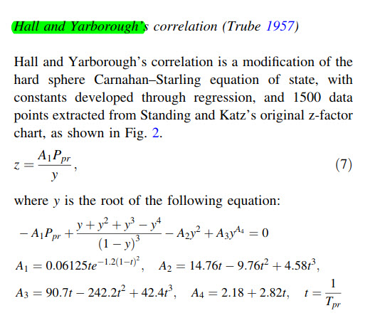
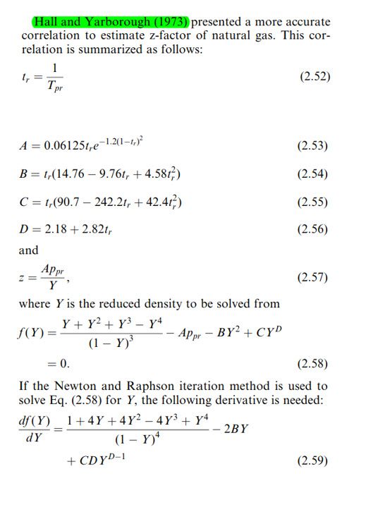
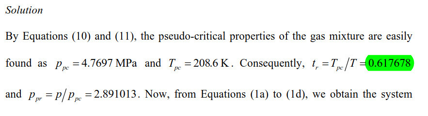
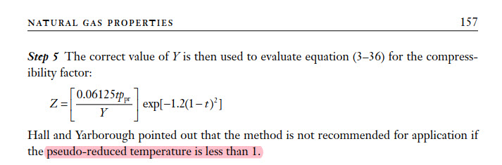

```{r setup, include=F, error=T, message=F, warning=F}
knitr::opts_chunk$set(echo=T, comment=NA, error=T, warning=F, message = F, fig.align = 'center')
```


## From paper by Kareem, Iwalezawa and Al-Marhoun
Link to paper: https://www.dropbox.com/s/xiaijtokwsu5ykt/JPT%206481%E2%80%93492%20New%20explicit%20correlation%20for%20the%20compressibility%20factor%20of%20natural%20gas%20%5B5star%20petroleum%20zfactor%5D.pdf?dl=0





## From book Guo, Lyons, Galambor, Petroleum Production Eng.
The equations are OK bt in the worksheet they use $P_{pr}$ to find $T_{pr}$.
The Excel workshet is included in this repository for analysis.





## From paper by Fatoorehchi, Abolghasemi, Rach and Assar
Link to paper: https://www.dropbox.com/s/3982pt63hi32p6c/10.1002%20cjce.22054%20-%20fatoorehchi2014.pdf?dl=0

### Hall-Yarborough equations


### Examples table


### Results. Fatoorachi


### Example 1. Fatoorechi paper
Find z given the data below:

    Temperature = 366.5 K = 200 F
    Pressure = 13.7895 MPa = 2000 psia
    Gas specific gravity = 0.7 
    yN2 = 0.05 
    yCO2 = 0.05 
    yH2S = 0.02 

We convert to oilfield units (Farenheit and psia).

```{r}
library(rNodal)

# Example 1 in Fantoorechi paper

print(z.hallyarborough(pres.a = 2000, temp.f = 200, gas.sg = 0.7,
                       n2.frac = 0.05, co2.frac = 0.05, h2s.frac = 0.02))
```

If we compare the value obtained with the value in the paper, $z(NR) = 0.8362$.

Let's use the internal function `z.hallyarboroughL` to check all the calculated values to obtain `z`.

```{r}
# use the internal function z.hallyarboroughL
print(rNodal:::z.hallyarboroughL(pres.a = 2000, temp.f = 200, gas.sg = 0.7,
                       n2.frac = 0.05, co2.frac = 0.05, h2s.frac = 0.02))
```

Using the equation for impurities in gas:


```{r}
# applying equation 11
gas.sg <- 0.7
n2.frac = 0.05
co2.frac = 0.05
h2s.frac = 0.02

temp.pc <- 326 + 315.7 * (gas.sg - 0.5) - 240 * n2.frac -
              83.3 * co2.frac + 133.3 * h2s.frac
print(temp.pc)
# 375.641 R = 208.6894 K
```

Which gives us 208.7 Kelvin,


```{r}
# from Fatorechi paper:
# Table 1, Example 1 solution
pres.pc.M <- 4.7697  # Mpa

# All temperatures in Kelvin
temp.K    <- 366.5   # sample temperature, Kelvin
temp.pc.K <- 208.6   # pseudo-critical temperature, Kelvin
temp.r <-  temp.pc.K / temp.K  # reduced temperature, adimensional
print(temp.r)
```

This value is different of what is shown in the solution of example 1 in the paper.



```{r}
# To double check the calculation, we run it in Farenheit (Rankine), not Kelvin.
# All temperatures in Rankine now
temp.F <- 200
temp.R <- temp.F + 460
temp.r <- temp.pc / temp.R
print(temp.r)
```

> Note. Definitely, something is not right: `0.569153` not equal to `0.617678`.

Performing the reverse process: calculating the sampling temperature from the reduced temperature.

```{r}
# calculating the sampling temperature from the reduced temperature.
# from the solution in Example 1, Fatoorechi
temp.pc.K <- 208.6 # Kelvin
temp.r    <- 0.617678
temp.K <-  temp.pc.K / temp.r
print(temp.K)
```

> Note: 337.7164 Kelvin is not equal either to 366.5 K given in the example.

## Example 2 from Fatoorechi paper
Given the second set of data, calculate Z.

    Temperature = 355.4 K = 180 F
    Pressure = 34.4747 MPa = 5000 psi
    Gas specific gravity = 0.65 
    yN2 = 0.1 
    yCO2 = 0.08 
    yH2S = 0.02 

We convert the Kelvin to Farenheit.

```{r}
library(rNodal)

# Example 2 in Fantoorechi paper

print(z.hallyarborough(pres.a = 5000, temp.f = 180, gas.sg = 0.65,
                       n2.frac = 0.1, co2.frac = 0.08, h2s.frac = 0.02))
```

From the paper, $z = 1.0002$.


## Example 3 from Fatoorechi paper

    Temperature = 310.9 K = 100 F
    Pressure = 6.8947 MPa = 1000 psi
    Gas specific gravity =  ?
    Tpc = 237.2 K  = -32.71 F = 427.29 R
    Ppc = 4.4815 MPa = 650 psia 

In this example the sepecific gravity of the gas is not provided.

```{r}
print(rNodal:::z.hallyarboroughL(pres.a = 1000, temp.f = 100, gas.sg = 0.82)$z)
# z = 0.760227
# from paper, z = 0.7557
```

From the paper, $z = 0.7557$. The difference is very small.
   
   

## Modifying the `rNodal` script to accept multiple parameters
We do this in order to enter not only sampling pressure and temperature but also be able to provide pseudo-critical and pseudo-reduced pressures and temperatures as well.

```{r results="hold"}
source("../R/HY.R")      # modified script saved as HY.R

# supplying gas.sg
with_gas.sg <- c(method = "use_gas.sg", 
                 z.hallyarboroughL(pres.a = 1000, temp.f = 100, gas.sg = 0.82))
# z = 0.760227
# pres.pc = 662
# temp.pc = 427.024

# no gas.sg provided
with_pseudo_crit <- c(method = "use_pseudo_critical", 
                      z.hallyarboroughL(pres.a = 1000, temp.f = 100,  
                                        pres.pc = 662, temp.pc = 427))

# no gas.sg provided
with_pseudo_red <- c(method = "use_pseudo_reduced", 
                     z.hallyarboroughL(pres.a = 1000, temp.f = 100,  
                                       pres.pr = 1.51, temp.pr = 1.31))

only_pseudo_red <- c(method = "only_pseudo_reduced", 
                     z.hallyarboroughL(pres.pr = 1.51, temp.pr = 1.31))

# put the results in a dataframe
df <- data.frame(stringsAsFactors = FALSE)
df <- rbind(df, with_gas.sg, with_pseudo_crit, with_pseudo_red, only_pseudo_red)
df
```
\
\
   

## Problems with using `rootSolve::uniroot.all`
We have noticed some strong deviation in he use of `rootSolve` when being applied to the solution of Hall-Yarborough correlation. It is extremely sensitive for $P_{pr}$ under 1.5.
See R chunk below.


### Calculate `z` for various values of $P_{pr}$ and $T_{pr}$

```{r results="hold"}
source("../R/HY.R")      # modified script saved as HY.R
z.hallyarboroughL(pres.pr = 0.5, temp.pr = 1.3)$z     # SK-chart = 0.92  x
z.hallyarboroughL(pres.pr = 1.5, temp.pr = 1.3)$z     # SK-chart = 0.76  x
z.hallyarboroughL(pres.pr = 2.5, temp.pr = 1.3)$z     # SK-chart = 0.64
z.hallyarboroughL(pres.pr = 3.5, temp.pr = 1.3)$z     # SK-chart = 0.63
z.hallyarboroughL(pres.pr = 4.5, temp.pr = 1.3)$z     # SK-chart = 0.68
z.hallyarboroughL(pres.pr = 5.5, temp.pr = 1.3)$z     # SK-chart = 0.76
z.hallyarboroughL(pres.pr = 6.5, temp.pr = 1.3)$z     # SK-chart = 0.84
```

```{r}
library(rNodal)
# we use instead or temp.pr and pres.pr the values of sampling pressure and 
# temperature and gas.sg = 07 because rNodal still has not been modified to 
# take pseudo-critical or pseudo-reduced P, T.

rNodal:::z.hallyarboroughL(pres.a = 334, temp.f = 45, gas.sg = 0.7)$z
```

## Values from Standing and Katz chart
These values have been read from the SK-chart. pres.pr = 

    (0.5, 1.3) = 0.92
    (1.5, 1.3) = 0.76
    (2.5, 1.3) = 0.64
    (3.5, 1.3) = 0.63
    (4.5, 1.3) = 0.68
    (5.5, 1.3) = 0.76
    (6.5, 1.3) = 0.84
    

## Plotting z vs $P_{pr}$ at various $T_{pr}$ using `HY.R`
This cold give us the proof that using the method of finding the root for the HY equation is not appropiate to find a solution for z.

It is essential that the boundaries selection for the root finding function are properly defined. 


### Selecting a poor interval for root finding
Below the is an example of a poor selection of the interval for root finding.
In thise case, the inerval selected is `c(-5, 5.99)`.
The reason for selecting this interval is that it was purely based on two examples.
Sadly, extreme cases were not tested, such as values of $P_{pr}$ lower than 2.5 or $T_{pr}$ lower than 1.4.

We will test in the following paragraphs other intervals.
We start by makng a function out of the chunk below first.

```{r}
source("../R/HY.R")  

ppr <- c(0.5, 1.5, 2.5, 3.5, 4.5, 5.5, 6.6)
tpr <- c(1.3, 1.5, 1.7, 2)
tbl <- sapply(ppr, function(x) 
    sapply(tpr, function(y) z.hallyarboroughL(pres.pr = x, temp.pr = y,
                                              interval = c(-5, 5.99))$z))
tbl

library(ggplot2)
plot(x = ppr, y = tbl[1,], type = "l", main = "z @ Tpr = 1.3")
plot(x = ppr, y = tbl[2,], type = "l", main = "z @ Tpr = 1.5")
plot(x = ppr, y = tbl[3,], type = "l", main = "z @ Tpr = 1.7")
plot(x = ppr, y = tbl[4,], type = "l", main = "z @ Tpr = 2.0")
```

## Testing other intervals for the root finding


```{r}
source("../R/HY.R")  
library(ggplot2)

testIntervals <- function(interval) {
    ppr <- c(0.5, 1.5, 2.5, 3.5, 4.5, 5.5, 6.6)
    tpr <- c(1.3, 1.5, 1.7, 2)
    tbl <- sapply(ppr, function(x) 
        sapply(tpr, function(y) z.hallyarboroughL(pres.pr = x, temp.pr = y,
                                                  interval = interval)$z))
    print(tbl)
    
    plot(x = ppr, y = tbl[1,], type = "l", main = "z @ Tpr = 1.3")
    plot(x = ppr, y = tbl[2,], type = "l", main = "z @ Tpr = 1.5")
    plot(x = ppr, y = tbl[3,], type = "l", main = "z @ Tpr = 1.7")
    plot(x = ppr, y = tbl[4,], type = "l", main = "z @ Tpr = 2.0")
}
```

```{r}
testIntervals(c(0, 1))
```

```{r}
testIntervals(c(0, 2))
```


### Discontinuity at Upper Limit (UL) = 100
It is safe to navigate the range 0 to 99.99. But solving the equation will fail at exactly UL = 100 because of inifinite values generated. All values above 100 will yield zero on all Ppr and Tpr supplied.


```{r}
testIntervals(c(0, 101))
```

Upper bound values above 4.3 also brings some discontinuity when the lower bound is, for instance, -1.

```{r}
testIntervals(c(-1, 4.4))
```

Or the interval (-9, 5).

```{r}
testIntervals(c(-9, 5))
```

The interval (-20, 20) seems safe but (-20, 100) is not.

```{r}
testIntervals(c(-20, 20))
```

## Using the 1st derivative method instead


```{r}

z.HY_derivative <- function(pres.pr, temp.pr, verbose = FALSE) {
    # Hall-Yarborough correlation modified to use the Newton-Raphson method

    tol <- 1E-13
    
    f <- function(y) {
        - A * pres.pr + (y + y^2 + y^3 - y^4) / (1 - y)^3  - B * y^2 + C * y^D    
    }
    
    fdot <- function(y) {
        (1 + 4 * y + 4 * y^2 - 4 * y^3 + y^4 ) / (1 - y)^4 - 2 * B * y + C * D * y^(D-1)
    }
    
    t <- 1 / temp.pr
    A <- 0.06125 * t * exp(-1.2 * (1 - t)^2)
    B <- t * (14.76 - 9.76 * t + 4.58 * t^2)
    C <- t * (90.7 - 242.2 * t + 42.4 * t^2)
    D <- 2.18 + 2.82 * t
    
    # first guess for y
    yk <- 0.0125 * pres.pr * t * exp(-1.2 * (1 - t)^2)
    delta <- 1
    i <- 1    # itertations
    while (delta >= tol) {
        fyk <- f(yk)
        if (abs(fyk) < tol) break
        yk1 <- yk - f(yk) / fdot(yk)
        delta <- abs(yk - yk1)
        if (verbose) cat(sprintf("%3d %10f %10f %10f \n", i, delta, yk, fyk))
        yk <- yk1
        i <- i + 1
    }    
    if (verbose) cat("\n")   
    y <- yk
    z <- A * pres.pr / y
    if (verbose) print(z)
    return(z)
}

z.HY_derivative(0.5, 1.3)

```

Now, we test with the the same test values in the Fatooreshi paper.

```{r}
# test HY with 1st-derivative using the values from paper

ppr <- c(0.5, 1.5, 2.5, 3.5, 4.5, 5.5, 6.5)
tpr <- c(1.3, 1.5, 1.7, 2)

tbl <- sapply(ppr, function(x) 
    sapply(tpr, function(y) z.HY_derivative(pres.pr = x, temp.pr = y)))

rownames(tbl) <- tpr
colnames(tbl) <- ppr
print(tbl)

library(ggplot2)
plot(x = ppr, y = tbl[1,], type = "l", main = "z @ Tpr = 1.3", ylab = "z")
plot(x = ppr, y = tbl[2,], type = "l", main = "z @ Tpr = 1.5", ylab = "z")
plot(x = ppr, y = tbl[3,], type = "l", main = "z @ Tpr = 1.7", ylab = "z")
plot(x = ppr, y = tbl[4,], type = "l", main = "z @ Tpr = 2.0", ylab = "z")
```

### How to the values obtained compare to Standing-Katz chart

Values from Standing and Katz chart
These values have been read from the SK-chart.

    (0.5, 1.3) = 0.92
    (1.5, 1.3) = 0.76
    (2.5, 1.3) = 0.64
    (3.5, 1.3) = 0.63
    (4.5, 1.3) = 0.68
    (5.5, 1.3) = 0.76
    (6.5, 1.3) = 0.84

    0.5, 1.5 = 0.94
    1.5, 1.5 = 0.86
    2.5, 1.5 = 0.79
    3.5, 1.5 = 0.77
    4.5, 1.5 = 0.79
    5.5, 1.5 = 0.84
    6.5, 1.5 = 0.89
    
    (0.5, 1.7) = 0.97
    (1.5, 1.7) = 0.92
    (2.5, 1.7) = 0.87
    (3.5, 1.7) = 0.86
    (4.5, 1.7) = 0.865
    (5.5, 1.7) = 0.895
    (6.5, 1.7) = 0.94  
    
    
    (0.5, 2.0) = 0.985
    (1.5, 2.0) = 0.957
    (2.5, 2.0) = 0.941
    (3.5, 2.0) = 0.938
    (4.5, 2.0) = 0.945
    (5.5, 2.0) = 0.97
    (6.5, 2.0) = 1.01


```{r}
ppr <- c(0.5, 1.5, 2.5, 3.5, 4.5, 5.5, 6.5)
tpr <- c(1.3, 1.5, 1.7, 2)

# data points from Standing-Katz chart
z <- c(
    c(0.92, 0.76, 0.64, 0.63, 0.68, 0.76, 0.84),
    c(0.94, 0.86, 0.79, 0.77, 0.79, 0.84, 0.89),
    c(0.97, 0.92, 0.87, 0.86, 0.865, 0.895, 0.94),
    c(0.985, 0.957, 0.941, 0.938, 0.945, 0.97, 1.01)
    )

# create a matrix of SK chart points
mx <- matrix(z, nrow = 4, ncol = 7, byrow = TRUE)
rownames(mx) <- tpr
colnames(mx) <- ppr
print(mx)

library(ggplot2)
plot(x = ppr, y = mx[1,], type = "l", main = "z SK @ Tpr = 1.3", ylab = "z")
lines(x = ppr, y = tbl[1,], col = "red")
legend("topright", c("F(Y)", "chart"), lty = c(1,1), col = c("black", "red"))
plot(x = ppr, y = mx[2,], type = "l", main = "z SK @ Tpr = 1.5", ylab = "z")
lines(x = ppr, y = tbl[2,], col = "red")
legend("topright", c("F(Y)", "chart"), lty = c(1,1), col = c("black", "red"))
plot(x = ppr, y = mx[3,], type = "l", main = "z SK @ Tpr = 1.7", ylab = "z")
lines(x = ppr, y = tbl[3,], col = "red")
legend("topright", c("F(Y)", "chart"), lty = c(1,1), col = c("black", "red"))
plot(x = ppr, y = mx[4,], type = "l", main = "z SK @ Tpr = 2.0", ylab = "z")
lines(x = ppr, y = tbl[4,], col = "red")
legend("topright", c("F(Y)", "chart"), lty = c(1,1), col = c("black", "red"))
```

We will compare the two tables:

```{r}
# calculate the error in percentage
(tbl - mx) / tbl * 100
```


## Limits of Hall-Yarborough correlation

HY is not recommended for $T_{pr} < 1$.




```{r}
tbl
mx
```

```{r}
plot(x = tbl[1, ], y = mx[1, ])
```

```{r}
library(ggplot2)
#df1 is the default dataset for all geoms
(plot1 <- ggplot(tbl, aes(Ppr, z)) + 
    geom_point() +
    geom_step(data = mx)
)
```

```{r}
 qplot(y=tbl[1,],x=mx[1,])
 qplot(y=tbl[1,],x=mx[1,]) + geom_jitter(width = 0.01, height = 0.01)
```

```{r}
 qplot(y=tbl[1,],x=tbl[1,], geom_point(y =mx[1,], x=mx[1,], col = "green"))
```

