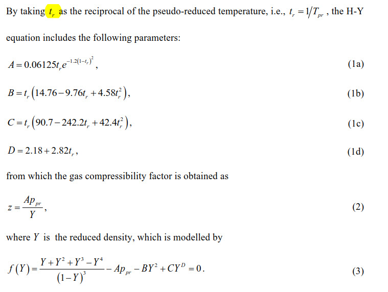
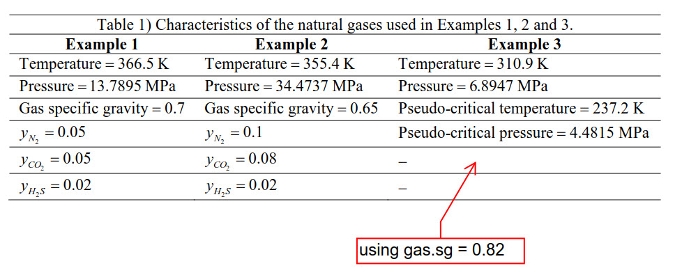
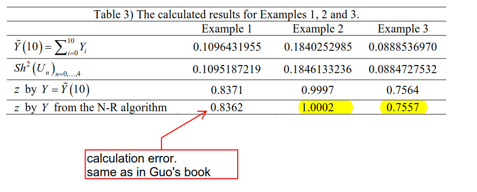

## From paper by Kareem, Iwalezawa and Al-Marhoun
Link to paper: https://www.dropbox.com/s/xiaijtokwsu5ykt/JPT%206481%E2%80%93492%20New%20explicit%20correlation%20for%20the%20compressibility%20factor%20of%20natural%20gas%20%5B5star%20petroleum%20zfactor%5D.pdf?dl=0

```{r, out.width = "800px", echo=F}
knitr::include_graphics("./images/eq_7_HY_LIM482.jpg")
```


## From book Guo, Lyons, Galambor, Petroleum Production Eng.
The equations are OK bt in the worksheet they use $P_{pr}$ to find $T_{pr}$.
The Excel workshet is included in this repository for analysis.

```{r, out.width = "800px", echo=F}
knitr::include_graphics("./images/eq_2-52_HY_GLG35.jpg")
```


## From paper by Fatoorehchi, Abolghasemi, Rach and Assar
Link to paper: https://www.dropbox.com/s/3982pt63hi32p6c/10.1002%20cjce.22054%20-%20fatoorehchi2014.pdf?dl=0

### Hall-Yarborough equations

```{r, out.width = "800px", echo=F}

```


### Examples table

```{r, out.width = "800px", echo=F}

```


### Results. Fatoorachi


```{r, out.width = "800px", echo=F}

```
